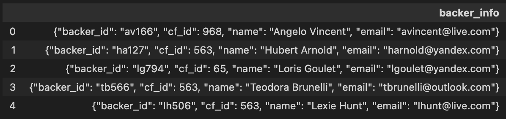
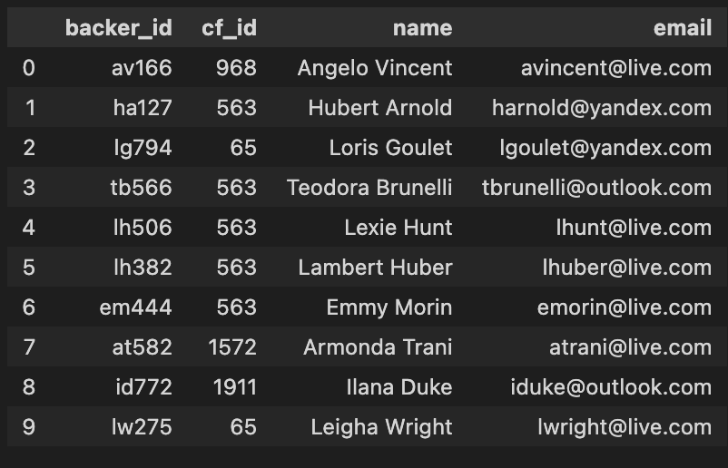
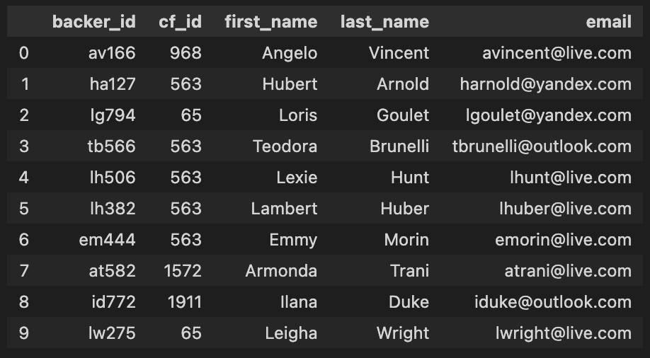
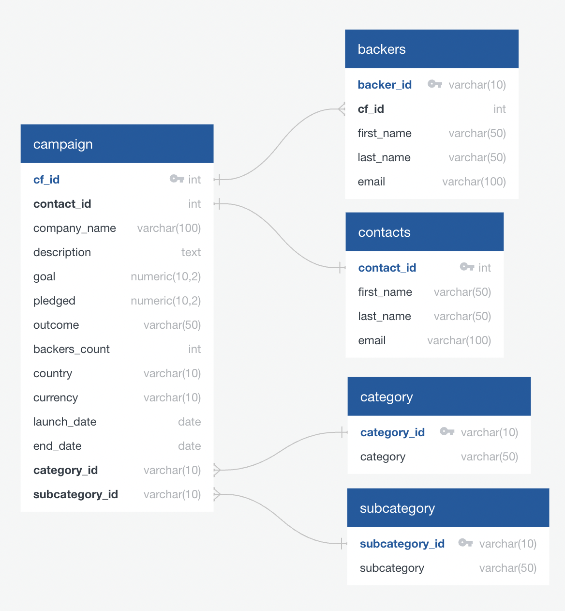
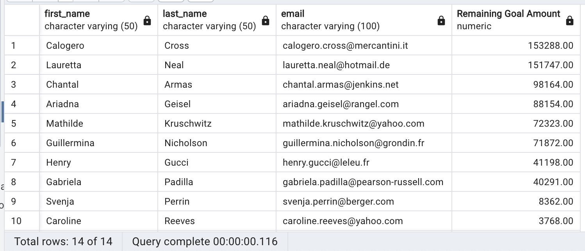
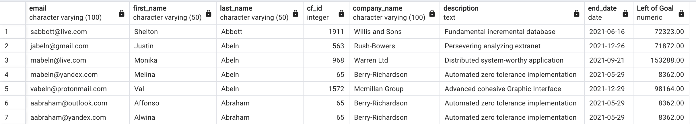

# Crowdfunding ETL

## Project Overview

### Purpose

The purpose of this project is to use `Jupyter Notebook` and `pgAdmin4`/`PostgreSQL` to perform **ETL (Extract, Transform, Load)** functions and a brief analysis of a crowdfunding dataset. The goals of this project are:

- **Extract** the initial data to separate columns.
- **Transform** the data into a better format for use in PostgreSQL.
- Create an ERD (Entity Relationship Diagram) for the database to be created.
- Create the database, using the schema outlined in the ERD.
- **Load** the appropriate CSV files into their designated tables.
- Perform an analysis to determine the crowdfunding projects which are still live:
  - Create a new table which has all the campaign owner's contact information of **live** campaigns, with remaining goal amounts.
  - Create a new table which has all the backers' contact information and associated campaign information of **live** campaigns, with remaining goal amounts.

## Extract, Transform, Load

### Extracting Data

The initial raw data of the backers contained rows of single string entries.



This was cleaned up by using `Regex` to target the data.

```python
backer_info_df["backer_id"] = backer_info_df["backer_info"].str.extract(r'(?:backer_id":\s")(\w{5})')
backer_info_df["cf_id"] = backer_info_df["backer_info"].str.extract(r'(?:cf_id":\s)(\d{2,4})')
backer_info_df["name"] = backer_info_df['backer_info'].str.extract(r'(?:name":\s")(\w+\s\w+)')
backer_info_df["email"] = backer_info_df["backer_info"].str.extract(r'(?:email":\s")(\w+@\w+\.\w+)')
```

The resulting data frame was much cleaner:



### Transforming Data

The data didn't need to be transformed drastically. The `cf_id` column was changed from a string to integer data type.

```python
backers_extracted_df["cf_id"] = backers_extracted_df["cf_id"].astype(int)
```

The `name` column was then also separated into `first_name` and `last_name` columns, and the `name` column was dropped.

```python
backers_extracted_df[["first_name","last_name"]] = backer_info_df["name"].str.split(" ", n=1, expand=True)
backers_clean_df = backers_extracted_df.drop(columns=["name"], axis=1)
```

The data frame was then reordered.

```python
backers_clean_df = backers_clean_df[["backer_id", "cf_id", "first_name", "last_name", "email"]]
```



### Loading Data

Using the fantastic ERD tool from [QuickDBD](https://www.quickdatabasediagrams.com/), the schema for the database was developed.



Once the schema was successfully applied to the database through `pgAdmin4`, the CSV files were loaded into the appropriate tables.

## Analysis

### Live Campaign Owner Contact Information

Joining both the contacts table and campaign table allowed for a simple query for the required information.

```sql
SELECT con.first_name,
	   con.last_name,
	   con.email,
	   cam.goal - cam.pledged AS "Remaining Goal Amount"
INTO email_contacts_remaining_goal_amount
FROM contacts as con
JOIN campaign as cam
ON con.contact_id = cam.contact_id
WHERE cam.outcome = 'live'
ORDER BY "Remaining Goal Amount" DESC;
```




### Live Campaign Backer Contact Information

Joining both the backers table and campaign table allowed for a simple query for the required information.

```sql
SELECT b.email,
	   b.first_name,
	   b.last_name,
	   b.cf_id,
	   c.company_name,
	   c.description,
	   c.end_date,
	   c.goal - c.pledged AS "Left of Goal"
INTO email_backers_remaining_goal_amount
FROM backers as b
JOIN campaign as c
ON b.cf_id = c.cf_id
WHERE c.outcome = 'live'
ORDER BY b.last_name, b.email;
```



